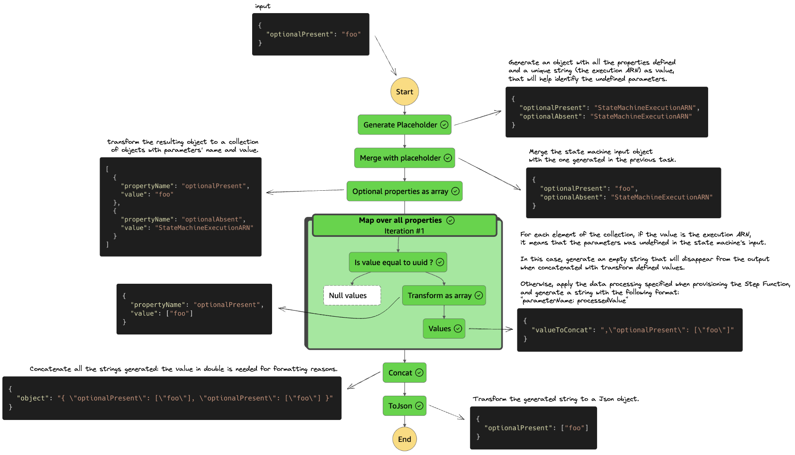

# Handle optional input parameters in AWS Step Functions

## Context

AWS Step Functions lets you do data processing on a state machine execution input thanks to its [intrinsic functions](https://docs.aws.amazon.com/step-functions/latest/dg/amazon-states-language-intrinsic-functions.html). However, when dealing with object inputs, you have to make sure that each property you want to process is present in the input, otherwise the execution will fail:

> An error occurred while executing the state 'Transform input values to array' (entered at the event id #2). The function 'States.Array(\<optionalProperty JsonPath\>)' had the following error: The JsonPath argument for the field '\<optionalProperty JsonPath\>' could not be found in the input '{
    "requiredProperty": 1
}'

This CDK construct enables you to do the same data processing on every values of an input object, while taking care of the optional parameters for you.

Head to the [motivation](./doc/motivation.md) documentation for more context.

## How it works

To use the construct, instanciate it with whatever data processing as if you wanted to apply it on a JsonPath `$.value`. for example, if you want to transform every object values into a 1-item array:

```typescript
const transformInputValuesTo1ItemArraysTask = new HandleOptionalParameters(
  scope,
  "Handle optional parameters",
  {
    requiredProperties: ["requiredProperty"],
    optionalProperties: ["optionalProperty1", "optionalProperty2"],
    // Apply States.Array intrinsinc function on every input values:
    dataProcessing: "States.Array($.value)",
    // Other examples:

    // Encode every input values and return the object with same input keys but with encoded values:
    // dataProcessing: "States.Base64Encode($.value)",

    // Concatenate the value with the property name, with the JsonPath $.propertyName:
    // dataProcessing: "States.Format('Current key is {} and associated value is {}.', $.propertyName, $.value)",
  }
);

new StateMachine(
  scope,
  "State machine using HandleOptionalParameters construct",
  {
    definition: processObjectValuesTask,
  }
);
```

It will provision the following tasks:


