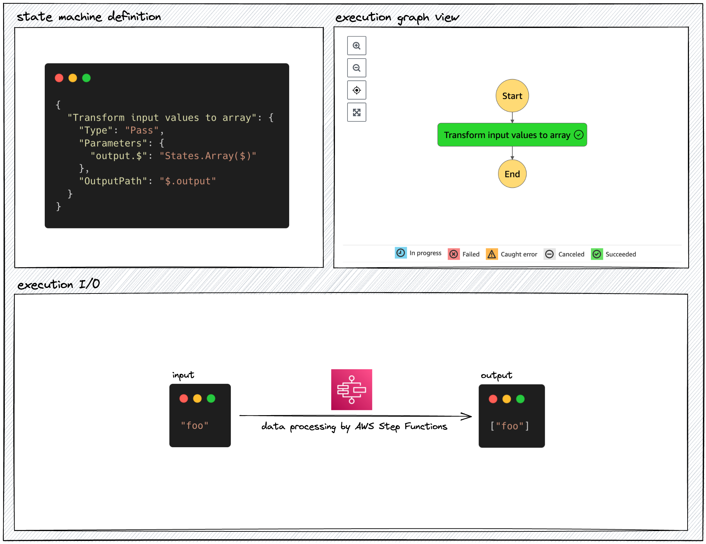
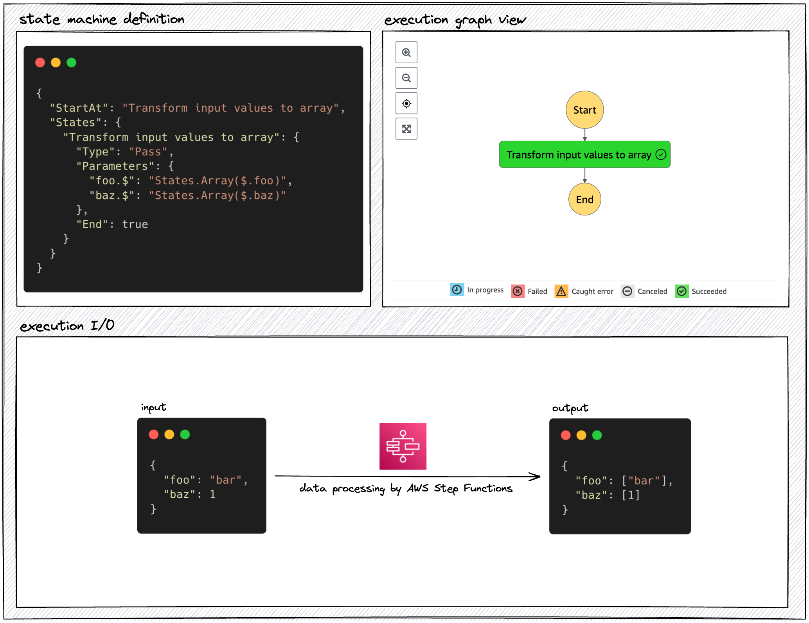
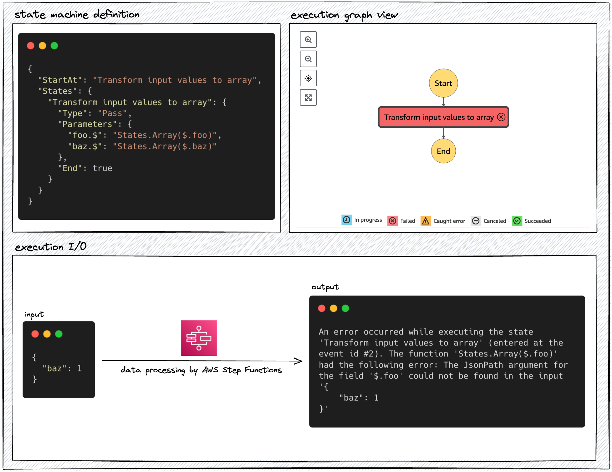
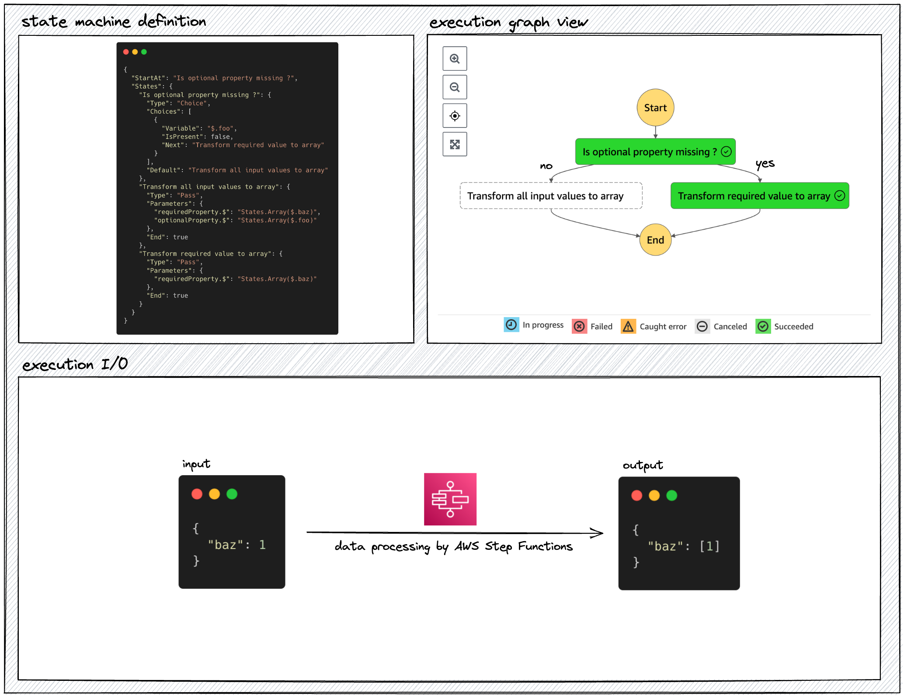
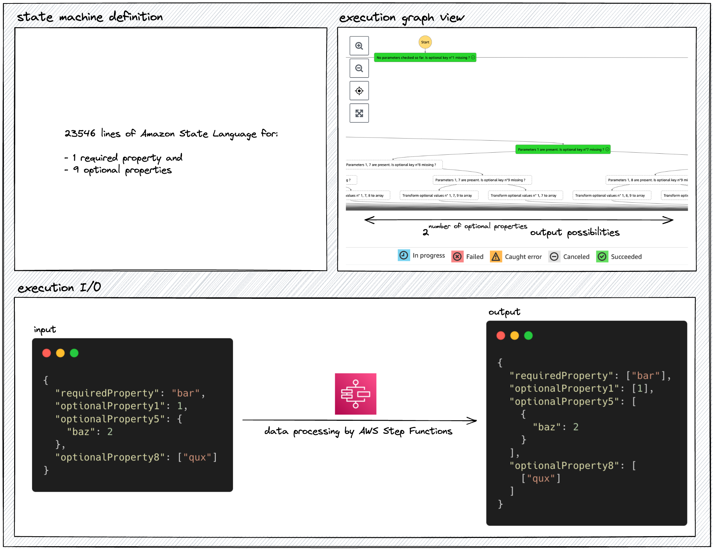
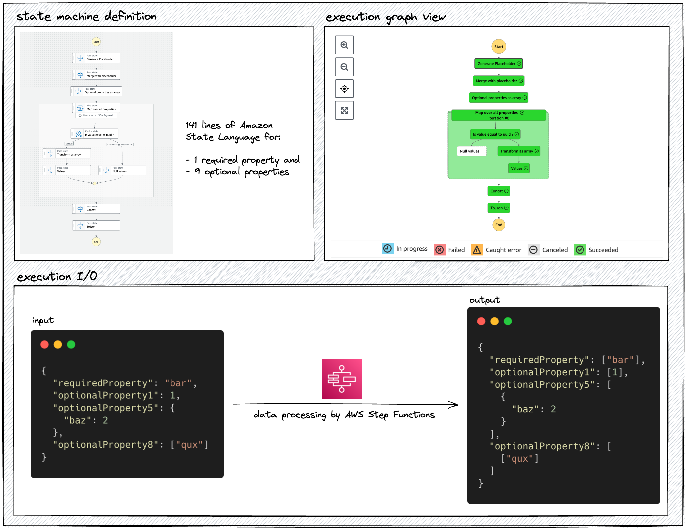

# Motivation

Let's use an example:

## 🔴 Context: transform object values in ASL

Your state machine needs to put every values of an object input in an array. 

To transform a value to an 1-item array containing this value with Amazon State Language, you can use the [`States.Array()` intrinsic function](https://docs.aws.amazon.com/step-functions/latest/dg/amazon-states-language-intrinsic-functions.html#asl-intrsc-func-arrays):

To transform every values of an input object, you can apply `States.Array()` on every properties:

However, the execution will fail if `foo` is actually optional and absent from the input ❌:

You thus need to handle optional parameters.

## 🟠 Common optional property handling solution: Choices

[Choice](https://docs.aws.amazon.com/step-functions/latest/dg/amazon-states-language-choice-state.html) is another common flow state of AWS Step Functions that enables you to decide on which branch to continue the state machine execution, based on a condition evaluated at run time. You can thus use a Choice state to evaluate the optional property's presence in the input, and apply the `States.Array()` function only if the property is defined in the input:

However, if the input has many optional values, your step function may look like this 😓:

This causes scalability issues:

- 🧑‍💻 **DX:** as you can see in the execution graph view, debugging is painful in the AWS console
- 🛑 **AWS limitations:** in my case, Cloudformation template hard size limit of 1MB is reached with 10 optional properties
- 💸 **Cost:** in a standard workflow, billing depends on the number of state transition which is proportional to the number of optional properties
- 🚀 **Performance:** Choices are not parallelised which leads speed to be proportional to the number of optional properties

You thus need to handle the scalability of your optional parameters.

## 🟢 Scalable optional property handling solution: a combination of Pass states

The `HandleOptionalProperties` CDK construct processes every present values with whatever data processing you provide, in 9 common flow tasks (and the possibility to turn them into a nested state machine):

